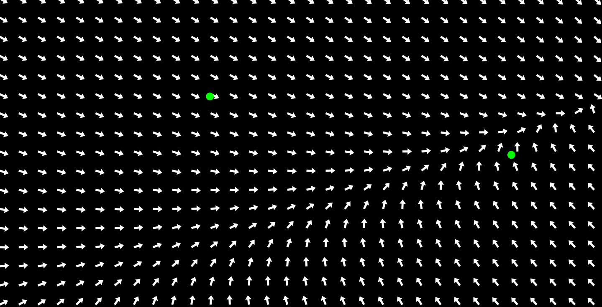

# JSVectorialField
## Introduction
A Javascript programms that displays any vector field, or parametric functions.  
To specify the formula, just open "sketch.js" and replace the parameters of the c.plottedFunction Vector by the values you want (x and y are the positions of the objects to be plotted, and dt represents the elapsed time since the beginning of the simulation).

## Example of a function

